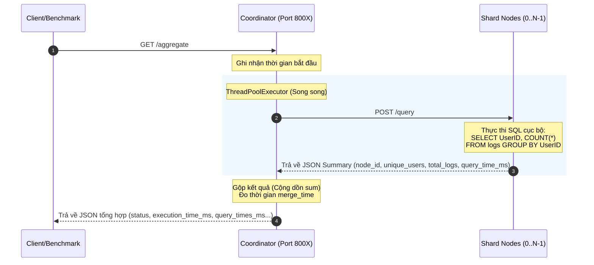

# 🔀 ShardMasters — Horizontal Scaling Efficiency

> **Đồ án môn Cơ sở dữ liệu phân tán | Đề tài #94: "Sharding Gains"**
>
> Một mô hình thực nghiệm giả lập hệ thống cơ sở dữ liệu phân tán để đo lường định lượng tốc độ tăng tốc (Speedup) và hiệu suất song song (Efficiency) khi thực hiện phân mảnh ngang dạng băm (Hash‑based Horizontal Sharding).

**Công nghệ sử dụng:** Python 3.10+ | Flask 3.1+ | SQLite | Matplotlib

---

## 📝 Mô tả dự án

Hệ thống mô phỏng cơ sở dữ liệu phân tán sử dụng chiến lược **phân mảnh ngang sơ cấp dạng băm** (Hash-based Horizontal Fragmentation) để đánh giá hiệu quả của việc mở rộng ngang (horizontal scaling).

Đồ án đo lường và phân tích thời gian thực thi của truy vấn phân tích tổng hợp kinh điển:

```sql
SELECT UserID, COUNT(*) FROM logs GROUP BY UserID
```

Truy vấn này được thực thi song song trên cụm gồm 1 → 2 → 4 nodes lưu trữ độc lập trên SQLite. Dữ liệu thử nghiệm gồm 1.000.000 bản ghi nhật ký hoạt động (User_Logs).

Kết quả thực nghiệm được đối chiếu với Định luật Amdahl để tính toán phần xử lý tuần tự (serial fraction) và xác định giới hạn tăng tốc thực tế của hệ thống.

---

## 🏗️ Kiến trúc hệ thống

Dự án được triển khai theo mô hình kiến trúc **3 tầng (3-tier)** phân tán giả lập trên localhost:

```text
                                  ╔═══════════════════════╗
                                  ║   CLIENT / BENCHMARK  ║
                                  ║     (benchmark.py)    ║
                                  ╚══════════╦════════════╝
                                             ║
                                             ║ HTTP GET /aggregate
                                             ▼
                                  ╔═══════════════════════╗
                                  ║      COORDINATOR      ║
                                  ║     (Port 8000+)      ║
                                  ║    Merge & Reduce     ║
                                  ╚══╦═══╦═════════╦═══╦══╝
                                     ║   ║         ║   ║
         ╔═══════════════════════════╝   ║         ║   ╚═══════════════════════════╗
         ║ HTTP POST /query              ╚═╗     ╔═╝              HTTP POST /query ║
         ▼                                 ▼     ▼                                 ▼
   ╔══════════╗                      ╔══════════╗  ╔══════════╗                 ╔══════════╗
   ║  Node 0  ║                      ║  Node 1  ║  ║  Node 2  ║                 ║  Node 3  ║
   ║ Port 5X00║                      ║ Port 5X01║  ║ Port 5X02║                 ║ Port 5X03║
   ║  SQLite  ║                      ║  SQLite  ║  ║  SQLite  ║                 ║  SQLite  ║
   ║ Shard 0  ║                      ║ Shard 1  ║  ║ Shard 2  ║                 ║ Shard 3  ║
   ╚══════════╝                      ╚══════════╝  ╚══════════╝                 ╚══════════╝

Sharding: node_id = UserID % N (Hash-based Horizontal Fragmentation)
```

### 📊 Sơ đồ kiến trúc trực quan (Mermaid)

```mermaid
graph TD
    Client[Client / Benchmark Suite <br> benchmark.py / run_benchmark.py] -->|HTTP GET /aggregate| Coord[Coordinator <br> Port 800X]

    subgraph Cluster phân tán (Port 5X00+)
        Coord -->|HTTP POST /query <br> ThreadPoolExecutor| Node0[Node 0 <br> SQLite Shard 0]
        Coord -->|HTTP POST /query <br> ThreadPoolExecutor| Node1[Node 1 <br> SQLite Shard 1]
        Coord -->|HTTP POST /query <br> ThreadPoolExecutor| Node2[Node 2 <br> SQLite Shard 2]
        Coord -->|HTTP POST /query <br> ThreadPoolExecutor| Node3[Node 3 <br> SQLite Shard 3]
    end

    Node0 -->|Duyệt chỉ mục| DB0[(node_0.db <br> idx_userid)]
    Node1 -->|Duyệt chỉ mục| DB1[(node_1.db <br> idx_userid)]
    Node2 -->|Duyệt chỉ mục| DB2[(node_2.db <br> idx_userid)]
    Node3 -->|Duyệt chỉ mục| DB3[(node_3.db <br> idx_userid)]

    style Client fill:#f9f,stroke:#333,stroke-width:2px
    style Coord fill:#bbf,stroke:#333,stroke-width:2px
    style Cluster phân tán fill:#f9f9f9,stroke:#666,stroke-dasharray: 5 5
```

### 🔄 Quy trình xử lý truy vấn (Scatter-Gather)



1. Client gửi `GET /aggregate` đến Coordinator.
2. Coordinator dùng `ThreadPoolExecutor` gửi `POST /query` song song đến N node.
3. Mỗi node thực thi `GROUP BY` trên SQLite cục bộ, trả về JSON summary (`unique_users`, `total_logs`, `query_time_ms`).
4. Coordinator cộng dồn (sum) các giá trị nhận được.
5. Coordinator trả về JSON kết quả tổng hợp cho client.

- **Thước đo chính:** $\max(\text{query\_time\_ms})$ – thời gian của node chậm nhất (bottleneck thực tế).

---

## ⚡ Chiến lược phân mảnh dữ liệu

Hệ thống áp dụng phương pháp phân mảnh ngang sơ cấp dựa trên hàm băm (modulo):
$$\text{NodeID} = \text{UserID} \pmod N$$
_(Với $N = 1, 2, 4$)_

### Đảm bảo 3 tính chất của phân mảnh ngang (theo Özsu & Valduriez):

1. **Completeness (Đầy đủ):** Mọi dòng dữ liệu đều được phân phối vào một node vì phép modulo luôn trả về giá trị hợp lệ từ $0$ đến $N-1$.
2. **Reconstruction (Tái tạo):** Dữ liệu gốc có thể được khôi phục bằng phép `UNION` tất cả các mảnh.
3. **Disjointness (Tách biệt):** Mỗi `UserID` chỉ thuộc về duy nhất một mảnh, không trùng lặp.

> **Tối ưu hóa cốt lõi:** Khóa phân mảnh (`UserID`) trùng khớp hoàn toàn với thuộc tính trong mệnh đề `GROUP BY`. Điều này giúp bài toán trở thành song song hóa lý tưởng (**embarrassingly parallel**) – dữ liệu của mỗi nhóm nằm trọn vẹn trên một node, loại bỏ hoàn toàn chi phí trao đổi dữ liệu (_shuffling_) giữa các node.

---

## 📁 Cấu trúc thư mục dự án

```text
ShardMasters/
├── README.md                # Tài liệu hướng dẫn chính
├── requirements.txt         # Thư viện phụ thuộc (Flask, requests, matplotlib)
├── data/
│   ├── generate.py          # Sinh dữ liệu ngẫu nhiên (1M dòng user_logs.csv)
│   ├── shard.py             # Phân mảnh dữ liệu (UserID % N)
│   ├── user_logs.csv        # Tệp dữ liệu gốc (~40MB)
│   └── shards/              # Các tệp CSV phân mảnh trung gian
├── node/
│   ├── init_db.py           # Khởi tạo DB SQLite từ CSV + tạo chỉ mục B-tree
│   └── node_app.py          # Ứng dụng Flask chạy trên từng storage node
├── coordinator/
│   └── coordinator.py       # Bộ điều phối trung tâm (ThreadPoolExecutor + merge)
├── benchmark/
│   ├── benchmark.py         # Tự động đo hiệu năng cho cấu hình 1, 2, 4 node
│   ├── run_benchmark.py     # Pipeline chạy toàn bộ quy trình bằng 1-click
│   └── failure_test.py      # Kịch bản kiểm thử lỗi và khả năng phục hồi
├── analysis/
│   ├── analyze.py           # Tính toán speedup, efficiency và vẽ biểu đồ
│   └── charts/              # Các biểu đồ kết quả PNG sinh ra tự động
│       ├── execution_time.png
│       ├── speedup_ratio.png
│       └── efficiency.png
├── results/
│   ├── benchmark_results.csv   # Kết quả đo chi tiết từng lượt chạy
│   └── benchmark_summary.json  # Tổng hợp kết quả thống kê cuối cùng
└── demo/
    └── video_demo.mp4       # Video demo vận hành hệ thống
```

---

## 🛠️ Cài đặt & Thiết lập

### Yêu cầu hệ thống

- **Python 3.10** trở lên
- Hệ điều hành: Windows / macOS / Linux

### Các bước thiết lập

1. **Tải mã nguồn về máy cục bộ:**
   ```bash
   git clone https://github.com/TuIT-198/Distributed-Database.git
   cd ShardMasters
   ```
2. **Cài đặt các thư viện cần thiết:**
   ```bash
   pip install -r requirements.txt
   ```

---

## 🚀 Hướng dẫn vận hành

### Cách 1: Chạy nhanh bằng 1-Click Pipeline (Khuyên dùng)

Để tự động thực hiện toàn bộ quy trình: Sinh dữ liệu $\rightarrow$ Phân mảnh $\rightarrow$ Khởi tạo DB $\rightarrow$ Chạy Benchmark $\rightarrow$ Vẽ biểu đồ, bạn chỉ cần thực thi một lệnh duy nhất:

```bash
python benchmark/run_benchmark.py
```

### Cách 2: Thực hiện thủ công từng bước

- **Bước 1: Sinh bộ dữ liệu 1 triệu bản ghi**
  ```bash
  python data/generate.py
  ```
- **Bước 2: Phân mảnh ngang dữ liệu (N = 1, 2, 4)**
  ```bash
  python data/shard.py --nodes 4
  ```
- **Bước 3: Khởi tạo cơ sở dữ liệu SQLite cục bộ cho từng node**
  ```bash
  python node/init_db.py 0 --csv-dir data/shards --db-dir node
  # Lặp lại cho các node 1, 2, 3 tùy cấu hình
  ```
- **Bước 4: Thực hiện benchmark**
  ```bash
  python benchmark/benchmark.py
  ```
- **Bước 5: Phân tích hiệu năng và xuất biểu đồ**
  ```bash
  python analysis/analyze.py
  ```

---

## 📊 Kết quả thực nghiệm

Kết quả đo đạc chính thức được trích xuất từ tệp `results/benchmark_summary.json`.

### 1. Chi tiết thời gian thực thi (ms)

Thời gian thực thi được tính bằng $\max(\text{query\_time\_ms})$ – thời gian SQL của node chậm nhất (bottleneck thực tế).

| Cấu hình    | Lần 1 | Lần 2 | Lần 3 | Lần 4 | Lần 5 | Trung bình (Mean) | Trung vị (Median) | P99 (Tail) | Độ lệch chuẩn (Std) |
| :---------- | :---: | :---: | :---: | :---: | :---: | :---------------: | :---------------: | :--------: | :-----------------: |
| **1 Node**  | 184.2 | 184.4 | 180.5 | 183.2 | 187.5 |   **183.9 ms**    |     184.2 ms      |  187.4 ms  |       2.5 ms        |
| **2 Nodes** | 93.2  | 95.1  | 91.1  | 95.3  | 89.5  |    **92.8 ms**    |      93.2 ms      |  95.3 ms   |       2.5 ms        |
| **4 Nodes** | 86.3  | 80.5  | 48.8  | 51.9  | 74.1  |    **68.3 ms**    |      74.1 ms      |  86.1 ms   |       17.0 ms       |

### 2. Speedup và Efficiency

| Cấu hình    | Speedup (S) | Efficiency (E) | Nhận xét                                               |
| :---------- | :---------: | :------------: | :----------------------------------------------------- |
| **1 Node**  |    1.00x    |     100.0%     | Baseline                                               |
| **2 Nodes** |  **1.98x**  |   **99.1%**    | Gần như tuyến tính lý tưởng ($S(n) \approx n$)         |
| **4 Nodes** |  **2.69x**  |   **67.3%**    | Hiệu suất giảm do chi phí truyền thông và phần tuần tự |

> **Hiện tượng Page Cache và B-Tree Depth:** Khi phân mảnh dữ liệu nhỏ hơn (1M $\rightarrow$ 500K $\rightarrow$ 250K dòng), kích thước file SQLite giảm giúp toàn bộ dữ liệu nằm gọn trong bộ nhớ đệm trang của Hệ điều hành (**OS Page Cache**). Đồng thời độ sâu của cây chỉ mục B-tree giảm, giúp truy vấn cục bộ trên mỗi node đạt tốc độ nhanh vượt trội.

### 3. Phân tích theo Định luật Amdahl

Với speedup đo được ở 4 node ($S(4) = 2.692$), phần tuần tự (_serial fraction_) $f$ được ước lượng:
$$f = \frac{\frac{1}{2.692} - \frac{1}{4}}{1 - \frac{1}{4}} = \frac{0.3715 - 0.25}{0.75} = \frac{0.1215}{0.75} \approx \mathbf{16.2\%}$$

- **Các thành phần gây ra phần tuần tự $f$:**
  - Thời gian coordinator nhận và parse request.
  - Chi phí khởi tạo và quản lý thread pool (`ThreadPoolExecutor`).
  - Chi phí serialization/deserialization JSON qua HTTP.
  - Thời gian merge kết quả (cộng dồn) tại coordinator.

- **Giới hạn tăng tốc tối đa khi số node tiến đến vô cùng:**
  $$S_{max} = \frac{1}{f} = \frac{1}{0.162} \approx \mathbf{6.17\text{ lần}}$$

### 4. Biểu đồ trực quan hóa hiệu năng

Các biểu đồ được sinh tự động nằm trong thư mục [analysis/charts/](file:///d:/ShardMasters/analysis/charts):

- **[execution_time.png](file:///d:/ShardMasters/analysis/charts/execution_time.png):** So sánh Mean, Median và P99 theo số node.
- **[speedup_ratio.png](file:///d:/ShardMasters/analysis/charts/speedup_ratio.png):** Tốc độ tăng tốc thực tế so với lý tưởng.
- **[efficiency.png](file:///d:/ShardMasters/analysis/charts/efficiency.png):** Hiệu suất song song theo số node.

---

## 🛡️ Kiểm thử chịu lỗi (Graceful Degradation)

Hệ thống hỗ trợ cơ chế suy giảm chất lượng lũy tiến khi xảy ra sự cố sập nút mạng.

### Chạy kịch bản kiểm thử lỗi

```bash
python benchmark/failure_test.py
```

### Cách thức hoạt động và phản ứng của hệ thống:

1. Kịch bản khởi tạo cụm 4 node hoạt động bình thường $\rightarrow$ baseline.
2. Mô phỏng sự cố bằng cách tắt đột ngột (**kill**) Node 2 (chứa các bản ghi có `UserID % 4 == 2`).
3. Gửi lại truy vấn tổng hợp đến coordinator.
4. **Kết quả phản hồi của coordinator:**
   - Hệ thống không bị crash, tiếp tục hoàn thành yêu cầu.
   - Trạng thái trả về: `"status": "partial"` (thay vì `"success"`).
   - Số node phản hồi: `3 / 4`.
   - Dữ liệu bị thiếu chính xác **~25%** (mất shard trên Node 2).
   - Response có chứa danh sách `failed_nodes` chi tiết.
   - Thời gian thực thi tăng do coordinator phải chờ timeout (10 giây) của node chết.
   - **Kết luận:** Hệ thống đảm bảo _graceful degradation_ – vẫn trả về kết quả có ích dù không đầy đủ.

---

## 👤 Thành viên thực hiện

- **Đàm Công Tú** (Mã sinh viên: **N23DCCN133**)
- Nhóm: **ShardMasters**
- Giảng viên hướng dẫn: **TS. Lê Hà Thanh**
- Học viện: Học viện Công nghệ Bưu chính Viễn thông (PTIT) – Cơ sở TP. Hồ Chí Minh
